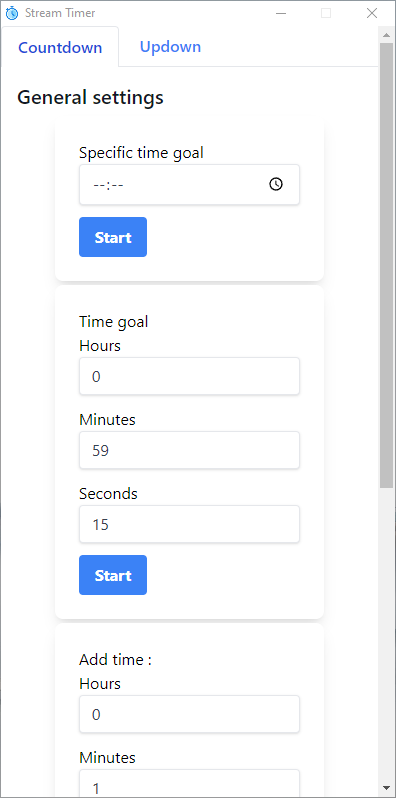
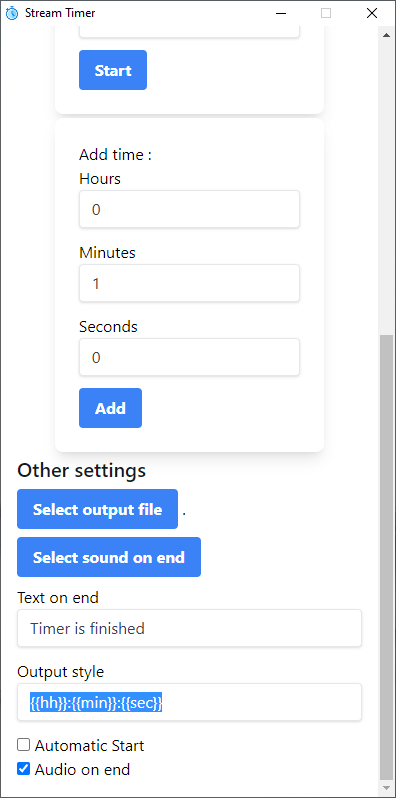

# StreamTimer-ElectronJS

A stream timer made with ElectronJS

## Screenshots

## Functionalities

- 'Countdown' or 'updown' timer
- Set a specific time goal. eg. : timer until 10:31am.
- Set a time goal. eg. : 5 minutes from start
- Add time during play
- Select output file
- Select sound 'on end'
- Option to mute the 'sound on end'
- Choose text displayed 'on end'
- Choose the output style of time. eg. : ``{{hh}}:{{min}}:{{sec}}``
- Option to automatically start the timer on application start
